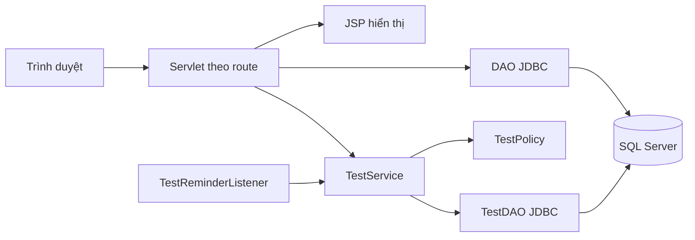
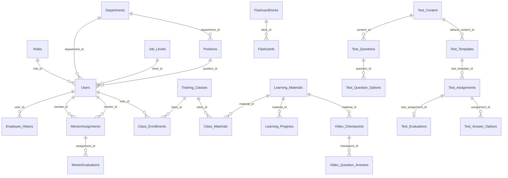
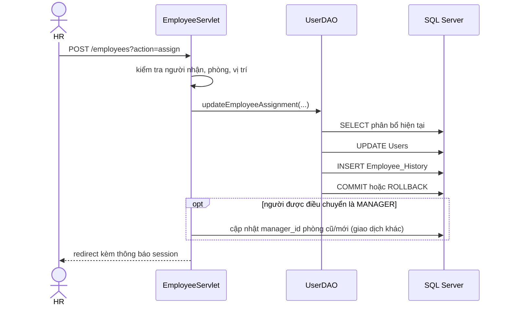
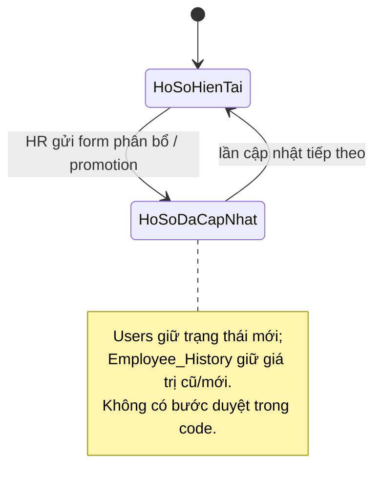
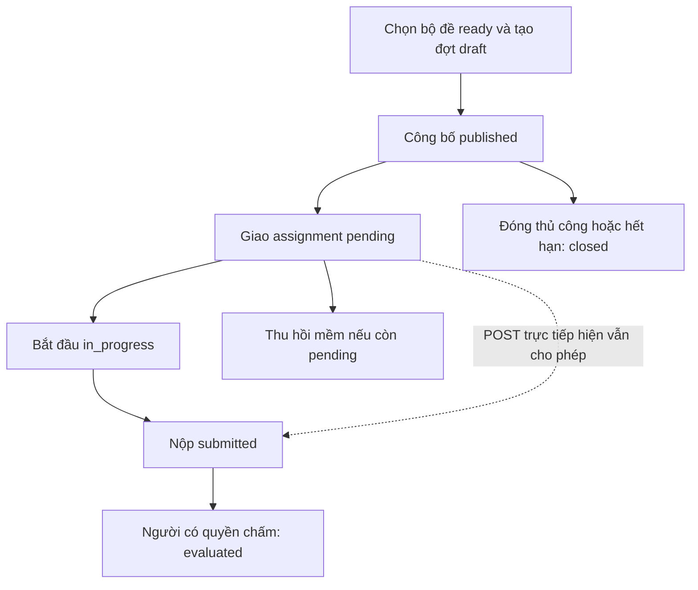

# Phân tích dự án HRM Career Path

> Khảo sát tĩnh mã nguồn ngày 06/10/2026. Báo cáo chỉ mô tả những gì tìm thấy trong repository; chưa chạy ứng dụng hoặc truy vấn database thật. Dẫn chứng dùng đường dẫn tương đối và tên class, hàm hoặc bảng. `[SUY ĐOÁN]` dành cho ý định sản phẩm chưa được code xác nhận. Không sao chép dữ liệu nhân sự hoặc thông tin đăng nhập từ seed, fixture và cấu hình.

## 1. Tóm tắt dự án

`hrm-career-path` là ứng dụng Java Web quản lý hồ sơ nhân sự, phòng ban, vị trí, cấp bậc, lịch sử điều chuyển/thăng chức, đào tạo, mentor, flashcard và bài test. Phần “career path” hiện được biểu diễn chủ yếu bằng vị trí/cấp bậc hiện tại của nhân viên và lịch sử thay đổi; chưa có mô hình lộ trình nhiều bước, khung năng lực hoặc quy trình duyệt thăng chức. HR cập nhật phân bổ nhân sự trực tiếp; ứng dụng ghi `Employee_History` trong cùng transaction với cập nhật `Users` (`src/java/controller/EmployeeServlet.java:assignEmployee`, `src/java/dal/UserDAO.java:updateEmployeeAssignment`). Bài test là module có Service/Policy/DAO riêng và quy trình giao, làm, chấm rõ hơn các module còn lại (`src/java/controller/TestServlet.java`, `src/java/service/TestService.java`, `src/java/policy/TestPolicy.java`).

## 2. Tech stack và kiến trúc

| Thành phần | Hiện trạng và dẫn chứng |
| --- | --- |
| Ngôn ngữ/runtime | Java 17 (`nbproject/project.properties`: `javac.source`, `javac.target`). |
| Web | Jakarta Servlet 6, JSP/JSTL; các route trong `web/WEB-INF/web.xml`, riêng `/tests` dùng `@WebServlet` ở `src/java/controller/TestServlet.java`. |
| Persistence | JDBC, Microsoft SQL Server (`src/java/dal/DBContext.java:getConnection`, `database/schema/create_tables_sqlserver.sql`). Không thấy ORM. |
| Build/deploy | NetBeans Ant Web Application, tạo WAR (`build.xml`, `nbproject/project.properties`: `war.name`, `j2ee.server.type=Tomcat`). `web/META-INF/context.xml` khai báo context path. |
| Cache/queue | Không thấy cache hay message broker. Job hết hạn dùng một `ScheduledExecutorService` trong webapp (`src/java/listener/TestReminderListener.java:contextInitialized`). |
| Cấu hình | DB URL/user/password có giá trị mặc định trong `DBContext`; có thể override bằng Java system properties `hrm.db.url/user/password` (`src/java/dal/DBContext.java:getConnection`). Không thấy `.env.example`, Docker Compose hay CI. |



Đây là ứng dụng nguyên khối. Module nhân sự/phòng ban/vị trí/mentor/học liệu thường gọi DAO trực tiếp từ Servlet; module bài test có thêm Service và Policy. Dẫn chứng: `src/java/controller/EmployeeServlet.java`, `DepartmentServlet.java`, `PositionServlet.java`, `MentorServlet.java`, `MaterialServlet.java` và `TestServlet.java`.

Entry points: `/login`, `/logout`, `/dashboard`, `/departments`, `/positions`, `/employees`, `/materials`, `/flashcards`, `/mentors` được khai báo trong `web/WEB-INF/web.xml`; `/tests` ở `src/java/controller/TestServlet.java`. Job duy nhất tìm thấy là `TestReminderListener.contextInitialized` tự đóng đợt test hết hạn. Không thấy CLI nghiệp vụ, webhook, import/export Excel hoặc event bus trong `src/java/controller`, `src/java/listener`, `web/WEB-INF/web.xml`.

Xác thực dùng `UserDAO.login` so khớp username/email và mật khẩu trong SQL, sau đó `LoginServlet.doPost` lưu `currentUser` vào `HttpSession`; `LogoutServlet.doGet` hủy session. Phần lớn module lấy role từ `currentUser` trong session; riêng `TestDAO.actor` đọc lại role và phòng ban đang hoạt động từ DB cho từng request. Dẫn chứng: `src/java/dal/UserDAO.java:login`, `src/java/controller/LoginServlet.java:doPost`, `src/java/controller/LogoutServlet.java:doGet`, `src/java/dal/TestDAO.java:actor`.

## 3. Cấu trúc thư mục

```text
hrm-career-path/
├─ database/
│  ├─ schema/             # DDL toàn hệ thống và migration module test
│  └─ seed_data/          # Dữ liệu mẫu; có thể chứa dữ liệu nhân sự nhạy cảm
├─ docs/                  # Thiết kế module bài test
├─ libs/                  # JAR phụ thuộc
├─ nbproject/             # Cấu hình Ant/NetBeans
├─ src/
│  ├─ conf/               # Manifest
│  └─ java/               # controller, dal, listener, model, policy, service, utils
├─ test/                  # Integration/HTTP test module bài test và script chạy
├─ web/
│  ├─ WEB-INF/            # web.xml, JSP và JAR web
│  ├─ META-INF/           # Tomcat context
│  ├─ assets/             # CSS
│  └─ views/              # JSP dashboard, nhân sự, phòng ban, vị trí, học liệu
└─ build.xml              # Ant build
```

Đã đọc source Java, schema, thiết kế test, route, các JSP liên quan luồng chính, cấu hình build và cấu trúc test. Chỉ khảo sát **cấu trúc** seed/fixture, không trích nội dung nhân sự. Bỏ qua `build/`, `dist/`, JAR và file binary. Không có README trong cây source khảo sát. Thư mục hiện tại không chứa `.git`, nên không kiểm chứng được git log và lịch sử commit; đây là giới hạn của phần nhận định về hướng phát triển.

## 4. Mô hình dữ liệu

### 4.1 ERD khái quát



ERD chỉ vẽ các quan hệ chính; schema còn FK từ các bảng đào tạo/test sang `Users`, `Departments`, `Positions`, `Job_Levels`. Toàn bộ định nghĩa nằm trong `database/schema/create_tables_sqlserver.sql` ở các bảng tương ứng.

| Nhóm | Bảng/thuộc tính quan trọng | Ý nghĩa, bằng chứng |
| --- | --- | --- |
| Tổ chức | `Roles(role_name)`, `Departments(manager_id,status,is_deleted)`, `Positions(department_id,status,is_deleted)`, `Job_Levels(level_name,rank_order)` | Role tổ chức, phòng ban, vị trí và cấp bậc là các danh mục riêng (`database/schema/create_tables_sqlserver.sql`: `Roles`, `Departments`, `Positions`, `Job_Levels`). |
| Nhân sự | `Users(role_id,department_id,position_id,level_id,hire_date,status,is_deleted)` | Mỗi nhân viên giữ **một** vị trí và cấp bậc hiện tại; không có bảng gán “career path” (`database/schema/create_tables_sqlserver.sql`: `Users`). |
| Biến động | `Employee_History(old_*/new_*,change_type,change_date,notes,created_by)` | Ghi thay đổi phòng/vị trí/level, có loại `NEW_HIRE`, `DEPARTMENT_TRANSFER`, `ROLE_CHANGE`, `PROMOTION`; không có approver, version hay quyết định duyệt (`database/schema/create_tables_sqlserver.sql`: `Employee_History`). |
| Mentor | `MentorAssignments(mentee_id,mentor_id,position_id,status,assigned_by)`, `MentorEvaluations(performance_score,feedback,approval_status)` | Gán mentor và lưu nhận xét; `approval_status` mặc định `PENDING` nhưng không thấy hàm duyệt (`database/schema/create_tables_sqlserver.sql`: hai bảng; `src/java/dal/MentorDAO.java:saveEvaluation`). |
| Đào tạo | `Learning_Materials(scope_type,department_id,position_id,level_id,material_type)`, `Training_Classes(target_position_id,target_level_id,mentor_id,status)`, `Class_Materials`, `Class_Enrollments(status,progress_percent)`, `Learning_Progress` | Nội dung/lớp có thể nhắm tới vị trí, cấp bậc; schema có tiến độ nhưng luồng ghi tiến độ chưa thấy trong DAO (`database/schema/create_tables_sqlserver.sql`: các bảng; `src/java/dal/MaterialDAO.java`). |
| Video học tập | `Video_Checkpoints`, `Video_Question_Answers` | Câu hỏi tại mốc video và câu trả lời; có `attempt_count` (`database/schema/create_tables_sqlserver.sql`: hai bảng; `src/java/dal/MaterialDAO.java:recordAnswer`). |
| Flashcard | `FlashcardDecks`, `Flashcards` | Bộ thẻ và câu hỏi/đáp án (`database/schema/create_tables_sqlserver.sql`: hai bảng; `src/java/dal/FlashcardDAO.java`). |
| Bài test | `Test_Content`, `Test_Questions`, `Test_Question_Options`, `Test_Templates`, `Test_Assignments`, `Test_Answer_Options`, `Test_Evaluations` | Tách bộ đề, đợt tổ chức, bài cá nhân, lựa chọn trả lời và điểm đánh giá (`database/schema/create_tables_sqlserver.sql`: phần `BEGIN TEST MODULE`). |

### 4.2 Career ladder và phần còn thiếu

`Job_Levels.rank_order` tạo thứ tự tuyến tính, nhưng không có FK nối `Positions` với `Job_Levels`, không có `track`, cạnh chuyển bậc hay điều kiện chuyển ngang. Một nhân viên có thể đổi phòng/vị trí/level bằng `EmployeeServlet.assignEmployee`; bản thân `change_type` là giá trị form gửi lên và DAO dùng mặc định `ROLE_CHANGE`, chưa suy ra tự động từ old/new (`src/java/controller/EmployeeServlet.java:assignEmployee`, `web/views/employees/employee-assign.jsp`, `src/java/dal/UserDAO.java:updateEmployeeAssignment`).

Không tìm thấy entity/bảng `Skill`, `Competency`, tiêu chí thăng tiến, KPI/OKR, review cycle, goal, IDP, nomination, approval step hoặc readiness trong `src/java/model`, `src/java/dal`, `database/schema/create_tables_sqlserver.sql`. Vì vậy không có công thức skill gap, trọng số hay ngưỡng thăng tiến để mô tả. `MaterialDAO.getSmartCandidatesForClass` có điểm 100/85/75/60/40 để **gợi ý học viên cho lớp**, dựa trên lịch sử gần đây, khớp vị trí/level hoặc phòng; điểm này không phải readiness thăng tiến.

Các trạng thái thực có trong schema: phòng/vị trí/nhân viên/học liệu dùng `status` và `is_deleted`; lớp `OPEN/IN_PROGRESS/COMPLETED/CANCELLED`; ghi danh `ENROLLED/IN_PROGRESS/PASSED/FAILED`; mentor assignment có mặc định `ACTIVE`; mentor evaluation mặc định `PENDING`; test content `draft/ready`, template `draft/published/closed`, assignment `pending/in_progress/submitted/evaluated`. Schema định nghĩa tập trạng thái, nhưng với lớp/ghi danh/mentor chưa tìm thấy state machine chuyển trạng thái hoàn chỉnh (`database/schema/create_tables_sqlserver.sql`; `src/java/dal/MaterialDAO.java`, `MentorDAO.java`).

## 5. Actor, phân quyền và chức năng

| Actor | Chức năng tìm thấy | Giới hạn và dẫn chứng |
| --- | --- | --- |
| ADMIN | Dashboard tổng hợp, xem một số danh mục/nhân sự, flashcard văn hóa; quản lý test Văn hóa | `DashboardServlet.doGet`, `EmployeeServlet.doGet`, `FlashcardServlet.doGet`, `TestPolicy.canManage`. ADMIN không làm bài test (`TestService.getMyAssignments`). |
| HR | Tạo/sửa phòng ban, vị trí, nhân sự; phân bổ phòng/vị trí/level; ghép mentor; quản lý học liệu/lớp và test | `DepartmentServlet.doPost`, `PositionServlet.doPost`, `EmployeeServlet.doPost`, `MentorServlet.doGet(action=pair)`, `MaterialServlet.canManage`, `TestPolicy.canManage`. Chưa có thao tác duyệt thăng chức. |
| MANAGER | Xem dashboard nhân viên phòng, xem phòng/vị trí, xem/sửa nhân sự theo route hiện tại; quản lý test Chuyên môn phòng | `DashboardServlet.doGet`, `DepartmentServlet.listDepartments`, `EmployeeServlet.doGet/doPost`, `TestPolicy.canManage`. Đáng chú ý: `EmployeeServlet` không áp kiểm tra phòng tại `showEditForm`, `showDetail`, `updateEmployee`; vì vậy quyền sửa có thể rộng hơn ý định. |
| EMPLOYEE | Xem hồ sơ/lịch sử của mình, tài liệu/lớp, mentor của mình, bài test được giao | `EmployeeServlet.doGet`, `DashboardServlet.doGet`, `MaterialServlet.doGet`, `MentorServlet.doGet(action=myMentor)`, `TestService.getMyAssignments`. |
| MENTOR | Xem mentee và lưu đánh giá mentor; cũng có thể xem học liệu/test theo các route chung | `MentorServlet.doGet(action=myMentees/evaluateForm)`, `MentorServlet.doPost(saveEvaluation)`. Route mentor hiện kiểm tra quyền không nhất quán, xem mục rủi ro. |

Không có actor “ban giám đốc” hoặc quyền phê duyệt nhiều cấp trong `Roles`/Servlet/schema. `role_id` dạng số được nhiều Servlet dùng trực tiếp, trong khi module test dùng `role_name` và Policy (`src/java/controller/EmployeeServlet.java`, `src/java/controller/PositionServlet.java`, `src/java/policy/TestPolicy.java`).

## 6. Chi tiết luồng nghiệp vụ

### 6.1 Định nghĩa danh mục vị trí và cấp bậc

**Trigger:** HR mở `/positions` và tạo/sửa/xóa vị trí. `PositionServlet.doPost` chỉ nhận role HR, kiểm tra tên không rỗng rồi gọi `PositionDAO.addPosition/updatePosition/deletePosition`; dữ liệu vào là tên, phòng, mô tả, trạng thái, dữ liệu ra là danh sách vị trí. Bảng bị ảnh hưởng là `Positions`, xóa bằng `is_deleted=1`. Lỗi SQL được DAO bắt và trả `false`, Servlet hiển thị thông báo session. Cấp bậc `Job_Levels` chỉ được `PositionDAO.getAllJobLevels` đọc để hiển thị/chọn trong form; không thấy route tạo/sửa/duyệt level. Không có versioning khung năng lực hay track (`src/java/controller/PositionServlet.java:doPost/createPosition/updatePosition/deletePosition`, `src/java/dal/PositionDAO.java`).

### 6.2 Gán vị trí, cấp bậc và ghi nhận thăng chức

**Trigger:** HR gửi form `/employees?action=assign`. Form nhận `userId`, `departmentId`, `positionId`, `levelId`, `changeType`, `notes`. `EmployeeServlet.assignEmployee` kiểm tra nhân viên tồn tại, quản lý không chuyển vào phòng đã có manager, vị trí có khớp phòng không; `UserDAO.updateEmployeeAssignment` đọc giá trị cũ, cập nhật `Users`, chèn `Employee_History` và commit trong một transaction. Nếu SQL lỗi thì rollback, trả thất bại; thông báo thành công/lỗi lưu vào session. Trường hợp chuyển phòng của manager, `DepartmentDAO.assignManager` cho phòng cũ/mới chạy **sau** transaction cập nhật Users/history và trên connection khác, nên có nguy cơ trạng thái không đồng bộ nếu bước này lỗi (`src/java/controller/EmployeeServlet.java:assignEmployee`, `src/java/dal/UserDAO.java:updateEmployeeAssignment`, `src/java/dal/DepartmentDAO.java:assignManager`).



Không có bước nomination, tự đánh giá, kiểm tra KPI/skill gap hay approve trước `UPDATE Users`. `PROMOTION` hiện là một lựa chọn `changeType` của form, không phải trạng thái phê duyệt. Vì quy trình phê duyệt chưa tồn tại, **không thể vẽ state diagram “draft → submitted → approved” như một chức năng thực**. Sơ đồ trạng thái đúng với code là:



### 6.3 Tự đánh giá, manager review và mentor evaluation

Không có luồng tự đánh giá, đánh giá 360 độ, KPI/OKR hoặc chu kỳ review trong schema/route. Luồng gần nhất là đánh giá mentor: HR mở `/mentors?action=pair` để chọn mentee/mentor, `MentorServlet.doPost(assign)` ghi `MentorAssignments` qua `MentorDAO.assignMentorWithPosition`; người dùng gửi `/mentors?action=saveEvaluation`, DAO chèn `MentorEvaluations` với `performance_score=8` do Servlet gán cố định, feedback từ form và `approval_status='PENDING'`. Không thấy route duyệt/từ chối evaluation hoặc chuyển kết quả sang hồ sơ thăng chức. `MentorDAO.getUnassignedNewEmployees` chọn nhân viên role EMPLOYEE cấp Intern/Fresher chưa có assignment ACTIVE. Ngoại lệ parse/SQL có thể trả lỗi hoặc chỉ log; không có thông báo ngoài session (`src/java/controller/MentorServlet.java:doGet/doPost`, `src/java/dal/MentorDAO.java:getUnassignedNewEmployees/assignMentorWithPosition/saveEvaluation/getAllEvaluations`).

### 6.4 Gợi ý học viên, lớp đào tạo, học liệu và tiến độ

**Trigger:** ADMIN/HR/MANAGER tạo học liệu hoặc lớp tại `/materials`. `MaterialServlet.doPost(saveMaterial/saveClass)` lấy nội dung, đối tượng mục tiêu, lịch và file; `MaterialDAO.saveMaterial/saveClass` ghi `Learning_Materials`, `Training_Classes`, `Class_Materials`. `saveClass` kiểm tra ngày bắt đầu không trong quá khứ, kết thúc không trước bắt đầu; DB giới hạn `status` và kiểu học liệu. Người quản lý mở `classAssign`; `MaterialDAO.getSmartCandidatesForClass` xếp hạng ứng viên chưa ghi danh bằng CASE SQL rồi `enrollBatch` chèn `Class_Enrollments` (`SMART_ASSIGN`). `getEnrollments` chỉ đọc `status/progress_percent`; không thấy lệnh cập nhật `Class_Enrollments.progress_percent` hoặc `Learning_Progress`, vì vậy theo dõi tiến độ lớp/học liệu mới ở mức schema/hiển thị. Lỗi ghi nhiều người trong `enrollBatch` có thể tạo kết quả một phần vì không thấy transaction bao quanh toàn bộ batch. Thông báo thành công/lỗi bằng session; không thấy email (`src/java/controller/MaterialServlet.java:doGet/doPost`, `src/java/dal/MaterialDAO.java:saveClass/getSmartCandidatesForClass/enrollBatch/getEnrollments`, `database/schema/create_tables_sqlserver.sql`: các bảng đào tạo).

Mốc video là luồng riêng: người quản lý thêm câu hỏi bằng `MaterialServlet.doPost(addCheckpoint)`; người học gửi `answerCheckpoint`, `MaterialDAO.recordAnswer` lưu/lần sau cập nhật đáp án và số lần thử vào `Video_Question_Answers`. Route này được chấp nhận cả qua GET và POST; GET đang làm thay đổi dữ liệu (`src/java/controller/MaterialServlet.java:doGet/doPost/answer`, `src/java/dal/MaterialDAO.java:recordAnswer`).

Không thấy entity IDP cá nhân gồm mục tiêu, deadline, chủ sở hữu và trạng thái hoàn thành. Lớp đào tạo là chức năng gần nhất nhưng chưa liên kết thành kế hoạch phát triển từng người (`database/schema/create_tables_sqlserver.sql`: `Training_Classes`, `Class_Enrollments`, `Learning_Progress`).

### 6.5 Bài test và đánh giá

**Trigger và người tham gia:** ADMIN/HR tạo bài Văn hóa; HR tạo bài Chuyên môn toàn công ty; MANAGER tạo bài Chuyên môn trong phòng mình. `TestPolicy.canManage`, `TestService.templateDepartment` và `TestDAO.management` thực thi phạm vi. ADMIN không nhận bài; MANAGER chỉ giao cho EMPLOYEE active đúng phòng; HR có thể giao cho tài khoản active không phải ADMIN (`src/java/policy/TestPolicy.java`, `src/java/service/TestService.java:templateDepartment/assignTest`, `src/java/dal/TestDAO.java:candidates`).

**Tạo/công bố:** `/tests?action=new` chọn đề database, loại, mô tả, thời gian GMT+7. `TestServlet.inputTime` đổi UTC; `TestService.createTemplate/validateTemplate` kiểm tra lịch, loại, phạm vi và chèn `Test_Templates` ở `draft`; `publishTemplate` chuyển sang `published` khi bộ đề mặc định `ready` và chưa hết hạn. Giao diện form tạo chỉ liệt kê nội dung `quiz` dù service và form giao hỗ trợ `question` (`src/java/controller/TestServlet.java:doPost`, `src/java/service/TestService.java:createTemplate/transition`, `web/WEB-INF/views/tests/index.jsp`: form `new`).

**Giao:** quản lý chọn 1–500 người và bộ đề ready đúng loại/phạm vi. `TestService.assignTest` tạo một `Test_Assignments` cho mỗi người trong transaction SERIALIZABLE; trùng `(test_template_id,assignee_id)` bị chặn ở DB. Trạng thái ban đầu `pending`; thu hồi chỉ khi pending và bởi người giao/cấp trên đủ quyền quản lý, bằng soft delete. Thông báo gửi đi: chỉ flash message trong session, không có email/notification test (`src/java/service/TestService.java:assignTest/revokeAssignment/transaction`, `database/schema/create_tables_sqlserver.sql`: `Test_Assignments`, `src/java/controller/TestServlet.java:doPost`).

**Làm/nộp:** người nhận bấm bắt đầu trong `[start_time,end_time)` khi template `published`; `startAssignment` đổi `pending → in_progress`. Tự luận gửi text hoặc file ≤5 MiB bằng `submitAssignment`; quiz gửi tập option ID, service kiểm tra câu và phương án thuộc đề, chấm `số câu đúng × 10 / tổng số câu`, làm tròn hai chữ số, rồi lưu `Test_Answer_Options`, `quiz_score`, `submitted_at`. Câu `multiple` chỉ đúng khi cả tập lựa chọn khớp hoàn toàn. Mọi submit chỉ một lần; sau hạn không nộp được. **Điểm lệch:** giao diện yêu cầu bấm bắt đầu, nhưng `TestPolicy.canSubmit` và SQL submit vẫn chấp nhận `pending`, nên POST trực tiếp có thể bỏ qua bước này (`src/java/service/TestService.java:startAssignment/submitAssignment/submitQuiz`, `src/java/policy/TestPolicy.java:canSubmit`, `web/WEB-INF/views/tests/index.jsp`: form assignment).

**Đánh giá/đóng:** người quản lý hợp lệ có role cao hơn người làm chấm bài `submitted`, điểm 0–10 tối đa 2 số thập phân, nhận xét bắt buộc. `TestService.evaluateAssignment` chèn `Test_Evaluations`, đổi assignment thành `evaluated` trong một transaction; unique key bảo đảm một evaluation/bài. Quiz score là điểm gợi ý, người chấm có thể đổi điểm cuối. Đợt `published → closed` bằng thao tác quản lý hoặc listener chạy mỗi phút; `pending` hết hạn được giữ là “Chưa làm”. Người dùng nhận kết quả qua trang assignment, không thấy thông báo chủ động (`src/java/service/TestService.java:evaluateAssignment/closeTemplate/closeExpiredTests`, `src/java/listener/TestReminderListener.java:contextInitialized`, `database/schema/create_tables_sqlserver.sql`: `Test_Evaluations`).



### 6.6 Dashboard, thông báo và đồng bộ

`DashboardServlet.doGet` trả số phòng, vị trí, nhân viên, nhân sự mới và biến động vai trò cho ADMIN/HR; MANAGER thấy nhân sự phòng mình; EMPLOYEE thấy hồ sơ và lịch sử cá nhân. Không thấy số headcount theo level, tỷ lệ thăng tiến, thời gian trung bình lên cấp, attrition risk. `UserDAO.countRoleChanges` là bộ đếm biến động, không phải báo cáo hiệu quả career path (`src/java/controller/DashboardServlet.java:doGet`, `src/java/dal/UserDAO.java:countRoleChanges`).

Không thấy email/Slack/push reminder. Listener chỉ tự đóng template test; tên class `TestReminderListener` không còn đồng nghĩa với gửi nhắc lịch. Khi HR thay đổi level/vị trí, chỉ `Users` và `Employee_History` thay đổi trong DB dự án, không thấy đồng bộ HRM khác/payroll/LMS (`src/java/listener/TestReminderListener.java`, `src/java/dal/UserDAO.java:updateEmployeeAssignment`).

### 6.7 Đối chiếu chín luồng career path được yêu cầu

| Luồng cần tìm | Kết quả kiểm tra | Dẫn chứng |
| --- | --- | --- |
| Khung năng lực và career ladder | Có danh mục `Positions` và `Job_Levels.rank_order`; thiếu skill/requirement, track, duyệt, version. | `database/schema/create_tables_sqlserver.sql`: `Positions`, `Job_Levels`; `PositionDAO.getAllJobLevels` |
| Gán lộ trình cho nhân viên | Chỉ gán trực tiếp phòng/vị trí/level; không có entity lộ trình cá nhân hay auto assignment. | `EmployeeServlet.assignEmployee`, `UserDAO.updateEmployeeAssignment`, schema `Users` |
| Tự đánh giá, manager/360 review, chu kỳ | Không tìm thấy; có mentor feedback và bài test là hai luồng khác. | `database/schema/create_tables_sqlserver.sql`: `MentorEvaluations`, `Test_Evaluations`; `MentorDAO.saveEvaluation`, `TestService.evaluateAssignment` |
| Readiness và skill gap | Không có công thức thăng tiến; Smart Match chỉ xếp người cho lớp. | `MaterialDAO.getSmartCandidatesForClass`; không có bảng skill/requirement trong schema |
| Nomination và phê duyệt thăng chức | Không có; HR cập nhật trực tiếp và gắn `change_type=PROMOTION`. | `EmployeeServlet.assignEmployee`, `UserDAO.updateEmployeeAssignment`, schema `Employee_History` |
| IDP, khóa học, mentor, tiến độ | Có lớp, học liệu, ghép mentor và cột tiến độ; chưa có IDP và luồng ghi tiến độ đầy đủ. | `MaterialServlet`, `MentorServlet`, schema `Class_Enrollments`, `Learning_Progress` |
| Cập nhật sau duyệt và đồng bộ | Có cập nhật `Users`/history nhưng không có bước duyệt trước đó hoặc đồng bộ ngoài. | `UserDAO.updateEmployeeAssignment`, `DBContext.getConnection` |
| Báo cáo/dashboard | Có headcount tổng, người mới, role changes, danh sách phòng và lịch sử cá nhân; thiếu báo cáo promotion theo level/thời gian/rủi ro nghỉ việc. | `DashboardServlet.doGet`, `UserDAO.countEmployees/countNewHires/countRoleChanges` |
| Thông báo và cron | Có job đóng bài test hết hạn; không thấy sender/nhắc việc cho career path. | `TestReminderListener.contextInitialized`, `TestDAO.closeExpiredTests` |

## 7. Bảng business rule

| Quy tắc | Cách thực hiện hiện tại | Vị trí code/schema | Test chuyên biệt? |
| --- | --- | --- | --- |
| Một ADMIN chưa xóa mềm | Unique filtered index | `database/schema/create_tables_sqlserver.sql`: `UQ_Users_SingleAdmin`; `EmployeeServlet.createEmployee` | Chưa thấy |
| Một MANAGER/phòng, một phòng/manager | Hai unique filtered index và kiểm tra form | `database/schema/create_tables_sqlserver.sql`: `UQ_Users_SingleManagerPerDept`, `UQ_Departments_SingleManager`; `EmployeeServlet.createEmployee/assignEmployee` | Chưa thấy |
| Vị trí phải cùng phòng khi tạo/gán nhân viên | Kiểm tra tại Servlet | `EmployeeServlet.createEmployee/assignEmployee` | Chưa thấy |
| Cập nhật phân bổ phải ghi lịch sử | `UPDATE Users` + `INSERT Employee_History` cùng transaction | `UserDAO.updateEmployeeAssignment` | Chưa thấy |
| Chỉ HR sửa vị trí/phòng | Role ID 2 tại Servlet | `PositionServlet.doPost`, `DepartmentServlet.doPost` | Chưa thấy |
| Lớp không bắt đầu trong quá khứ, kết thúc ≥ bắt đầu | Kiểm tra ngày ở Servlet | `MaterialServlet.doPost(saveClass)` | Chưa thấy |
| Gợi ý học viên lớp | Điểm 100/85/75/60/40 theo lịch sử/khớp target/phòng | `MaterialDAO.getSmartCandidatesForClass` | Chưa thấy |
| Một người/lớp | Unique `class_id,user_id` | `database/schema/create_tables_sqlserver.sql`: `UQ_Class_User` | Chưa thấy |
| Mentee chưa ghép là EMPLOYEE Intern/Fresher chưa có ACTIVE mentor | Bộ lọc SQL | `MentorDAO.getUnassignedNewEmployees` | Chưa thấy |
| Mentor evaluation mới ở PENDING | Insert mặc định, điểm 8 cố định ở Servlet | `MentorServlet.doPost(saveEvaluation)`, `MentorDAO.saveEvaluation` | Chưa thấy |
| ADMIN chỉ quản lý test Văn hóa, HR cả hai, MANAGER Chuyên môn phòng | TestPolicy và TestDAO lọc SQL | `TestPolicy.canManage`, `TestDAO.management` | Có, `TestModuleIntegrationTest.runTests` |
| MANAGER chỉ giao test cho EMPLOYEE cùng phòng; không giao ADMIN | Service/DAO kiểm tra active và role | `TestService.assignTest`, `TestDAO.candidates` | Có, `TestModuleIntegrationTest.runTests` |
| Một assignment/người/đợt, giao 1–500 người/lần | Unique + kiểm tra service/transaction | `TestService.assignTest`, schema `UQ_Test_Assignee` | Có, `TestModuleIntegrationTest.runTests` |
| Chỉ nộp test trong `[start,end)` khi published | Policy | `TestPolicy.canSubmit` | Có, `TestModuleIntegrationTest.runTests` |
| Quiz chấm tập đáp án đúng tuyệt đối, điểm 0–10 | Service tính trên server | `TestService.submitQuiz` | Có, `TestModuleIntegrationTest.runQuestionTests` |
| Một lần chấm, 0–10 và ≤2 chữ số thập phân | Service + unique evaluation | `TestService.evaluateAssignment`, schema `Test_Evaluations` | Có, `TestModuleIntegrationTest.runTests` |
| Chỉ cấp trên có quyền quản lý mới chấm | Role rank và policy | `TestPolicy.canEvaluateAssignee/canEvaluate` | Có một phần, `TestModuleIntegrationTest.runTests` |
| Hết hạn tự đóng đợt; pending còn trong báo cáo | Worker và DAO | `TestReminderListener.contextInitialized`, `TestDAO.closeExpiredTests` | Có, `TestModuleIntegrationTest.runTests` |

“Có test” nghĩa là tìm thấy assertion tương ứng trong source test; báo cáo này không chạy test vì yêu cầu chỉ đọc source và chỉ tạo file báo cáo.

## 8. Tích hợp bên ngoài

Tích hợp bắt buộc là SQL Server qua JDBC; deploy WAR trên Tomcat (`src/java/dal/DBContext.java`, `nbproject/project.properties`). Học liệu có URL/video nhúng và tạo preview qua Microsoft Office Online, Google Drive/Docs Viewer; giao diện tải YouTube iframe API và font/icon CDN. Đây là các liên kết hiển thị nội dung, không phải đồng bộ tài khoản hay dữ liệu nhân sự (`src/java/model/LearningMaterial.java:getPdfEmbedUrl`, `web/views/materials/material-detail.jsp`, `web/views/common/header.jsp`). Không tìm thấy mã SSO, chấm công, payroll, email/Slack, Jira/Git hoặc LMS hai chiều trong `src/java`, `web/WEB-INF/web.xml`, `nbproject/project.properties`.

## 9. Tình trạng hiện tại và hướng đi

| Mảng | Đánh giá từ code | Dẫn chứng |
| --- | --- | --- |
| CRUD tổ chức/nhân sự | Có chức năng chạy ở Servlet/DAO; RBAC chưa nhất quán | `DepartmentServlet`, `PositionServlet`, `EmployeeServlet`; các DAO tương ứng |
| Lịch sử thay đổi vị trí/level | Có và có transaction với Users; không phải approval workflow | `UserDAO.updateEmployeeAssignment`, schema `Employee_History` |
| Career ladder/skill framework/readiness/IDP | Chưa có mô hình và route | `database/schema/create_tables_sqlserver.sql`, `src/java/model`, `web/WEB-INF/web.xml` |
| Mentor | Ghép/xem/ghi đánh giá; approval_status chưa có luồng duyệt | `MentorServlet`, `MentorDAO` |
| Học liệu/lớp | Tạo, liên kết, gợi ý và ghi danh; tiến độ chủ yếu là schema/read | `MaterialServlet`, `MaterialDAO`, schema `Learning_Progress` |
| Bài test | Tạo, công bố, giao, làm, tự chấm quiz, đánh giá, đóng hết hạn; có integration và HTTP test source | `TestServlet`, `TestService`, `TestPolicy`, `TestDAO`, `test/TestModuleIntegrationTest.java`, `test/TestModuleHttpTest.java` |
| Flashcard | Đọc deck/card; POST còn gọi template `processRequest` | `FlashcardServlet.doGet/doPost`, `FlashcardDAO` |

Trong source còn template TODO ở `web/index.html` và hai `processRequest` sinh bởi NetBeans ở `FlashcardServlet`/`MentorServlet`; `FlashcardServlet.doPost` thực sự gọi template đó, còn `MentorServlet` dùng `doGet/doPost` riêng. Không thấy feature flag. Không có `.git` tại workspace này nên không thể dùng git log để suy ra roadmap. `[SUY ĐOÁN]` Hướng phát triển hợp lý là nối các phần lịch sử, test, mentor và đào tạo vào quy trình career path chính thức; đây là đề xuất kiến trúc, không phải kế hoạch đã được team xác nhận.

## 10. Rủi ro, technical debt và đề xuất

| Ưu tiên | Rủi ro có dẫn chứng | Đề xuất |
| --- | --- | --- |
| Rất cao | `UserDAO.login` so mật khẩu trực tiếp trong SQL, `EmployeeServlet.createEmployee` có mật khẩu mặc định, `DBContext` có thông tin kết nối mặc định trong source (`src/java/dal/UserDAO.java:login`, `EmployeeServlet.createEmployee`, `DBContext.getConnection`). | Hash mật khẩu bằng thuật toán chuyên dụng, bắt đổi mật khẩu ban đầu; chuyển secret ra cấu hình an toàn, xoay credential đã lộ. |
| Rất cao | `EmployeeServlet.showEditForm/updateEmployee/showDetail` không kiểm tra manager thuộc cùng phòng/nhân viên thuộc phạm vi; manager vẫn có thể POST edit. `MentorServlet.doPost(assign/saveEvaluation)` không áp role/ownership như GET (`src/java/controller/EmployeeServlet.java`, `MentorServlet.java`). | Dồn RBAC vào service/DAO, dùng scope theo user ID/phòng, kiểm tra mọi thao tác ghi và đọc chi tiết. |
| Cao | Các Servlet ngoài test thiếu CSRF; `MaterialServlet.doGet(deleteMaterial)` và `doGet(answerCheckpoint)` có thao tác ghi (`src/java/controller/MaterialServlet.java`, `DepartmentServlet.java`, `EmployeeServlet.java`, `MentorServlet.java`). | Bắt buộc POST/CSRF cho mutation; dùng filter hoặc helper thống nhất. |
| Cao | `MaterialServlet.canManage` cho ADMIN/HR/MANAGER trên mọi học liệu/lớp, DAO đọc tài liệu không lọc `scope_type/department_id`; route download/preview theo ID (`src/java/controller/MaterialServlet.java:canManage/stream`, `src/java/dal/MaterialDAO.java:getMaterials/getMaterial`). | Xác định chính sách từng phạm vi và áp lọc tại truy vấn; kiểm tra quyền tải file. |
| Cao | `MentorServlet.saveEvaluation` ghi điểm 8 cố định, không ràng evaluator phải là mentor của assignment; `approval_status` PENDING không có xử lý tiếp (`MentorServlet.doPost`, `MentorDAO.saveEvaluation`). | Kiểm tra owner, nhận điểm hợp lệ từ form, xây state transition duyệt/từ chối hoặc bỏ trường gây hiểu nhầm. |
| Cao | Bài Chuyên môn giao cho HR có thể không ai chấm: HR không cao hơn HR, ADMIN không quản lý Chuyên môn (`TestService.assignTest`, `TestPolicy.canManage/canEvaluateAssignee`). | Cấm assignment không có evaluator hợp lệ hoặc tách quyền chấm khỏi quyền quản lý đề. |
| Cao | Đề test tham chiếu `content_id`, chưa snapshot/version; đổi câu hỏi/đáp án sau giao làm khó đối soát (`database/schema/create_tables_sqlserver.sql`: `Test_Assignments.content_id`, `Test_Questions`, `Test_Question_Options`; `TestService.submitQuiz`). | Đóng băng version bộ đề tại lúc giao, lưu nguồn điểm và lịch sử điều chỉnh. |
| Trung bình | UI test yêu cầu “Bắt đầu” nhưng backend cho nộp từ `pending`; form tạo chỉ liệt kê quiz (`TestPolicy.canSubmit`, `TestService.submitQuiz/submitAssignment`, `web/WEB-INF/views/tests/index.jsp`). | Quyết định state bắt buộc, đồng bộ UI/service/SQL; cho chọn đề tự luận ngay khi tạo nếu nghiệp vụ yêu cầu. |
| Trung bình | Ghi danh batch không có transaction toàn lô; cập nhật phòng manager sau transaction phân bổ (`MaterialDAO.enrollBatch`, `EmployeeServlet.assignEmployee`, `UserDAO.updateEmployeeAssignment`). | Gộp những ghi dữ liệu liên quan vào một transaction hoặc thiết kế bù trừ. |
| Trung bình | `Learning_Progress` và enrollment progress có bảng nhưng không thấy luồng ghi; readiness/IDP chưa tồn tại (`MaterialDAO`, schema). | Xác định mô hình tiến độ và IDP trước khi mở rộng dashboard. |
| Trung bình | DDL đầu file drop/recreate toàn bộ database, còn migration test ở cuối là idempotent (`database/schema/create_tables_sqlserver.sql`: đầu file và `BEGIN TEST MODULE`). | Tách bootstrap phá hủy dữ liệu khỏi migration an toàn; không chạy toàn file trên database có dữ liệu. |
| Trung bình | Bài test dùng transaction SERIALIZABLE rộng và worker nội bộ từng Tomcat instance (`TestService.transaction`, `TestReminderListener`). | Theo dõi deadlock/latency, chỉ dùng khóa cần thiết; dùng scheduler có leader lock khi chạy nhiều instance. |
| Trung bình | Tự động/HTTP test tập trung ở module test; không thấy test cho nhân sự/mentor/đào tạo (`test/`). | Bổ sung test RBAC, phân bổ/promotion, transaction, tiến độ, XSS và CSRF. |
| Trung bình | HTTP test tạo lịch bằng `now.plusMinutes(1)` và tái sử dụng `now` sau nhiều request; có thể bị validation từ chối khi chạy chậm (`test/TestModuleHttpTest.java:run`, `TestService.validateTemplate`). | Tính thời gian mới ngay trước mỗi request hoặc inject clock trong test. |

### Khoảng cách so với hệ thống career path hoàn chỉnh

Để có lộ trình thăng tiến đúng nghĩa cần tối thiểu: `CareerTrack`, `CareerLevel/PositionRequirement`, skill/competency theo level, review theo chu kỳ, mục tiêu/IDP, công thức readiness và skill gap, nomination, approval nhiều cấp, hiệu lực quyết định, audit bất biến, báo cáo thăng tiến và chính sách riêng tư. Các khái niệm đó chưa có trong schema/controller hiện tại; danh sách này là **đề xuất**, không phải tính năng đã thực hiện.

## 11. Câu hỏi cần làm rõ với team/HR/chủ dự án

1. “Career path” mong muốn chỉ là lịch sử vị trí/level hay là lộ trình nhiều bậc có mục tiêu và điều kiện chuyển bậc?
2. Cấp bậc `Job_Levels` dùng chung mọi nghề hay mỗi track/vị trí cần tiêu chuẩn riêng? Có chuyển ngang giữa Engineering, QA, DevOps, Product... không?
3. Ai đề xuất, ai duyệt và ai có quyền hiệu lực hóa thăng chức? Có cần phê duyệt quản lý trực tiếp, HR, ban giám đốc và calibration không?
4. Năng lực được đo bởi ai, theo thang nào, có chu kỳ review và trọng số giữa KPI, test, mentor, đào tạo không?
5. `PROMOTION` trong form phân bổ là quyết định đã được duyệt ở hệ thống khác hay bản thân thao tác HR này là quyết định cuối cùng?
6. Bài Chuyên môn giao cho HR do ai chấm? ADMIN có cần quyền chỉ chấm, không quản lý đề?
7. Kết quả mentor `PENDING` do ai duyệt, khi nào cập nhật sang trạng thái khác và có tác động đến promotion không?
8. Tiến độ đào tạo cập nhật tự động từ video/checkpoint hay thủ công? Điều kiện `PASSED/FAILED` là gì?
9. Hồ sơ nhân viên nghỉ việc cần lưu và cho phép tra cứu trong bao lâu; ai được xem dữ liệu đánh giá cũ?
10. Có hệ thống HRM/SSO/payroll/LMS nguồn chuẩn để đồng bộ hay dự án này là system of record độc lập?

## 12. Hướng dẫn dev mới

1. Đọc `web/WEB-INF/web.xml` và `src/java/controller/LoginServlet.java` để hiểu route/session; đọc `src/java/dal/DBContext.java` để biết cơ chế cấu hình DB. Không sao chép credential mặc định vào tài liệu hoặc môi trường chia sẻ.
2. Đọc `database/schema/create_tables_sqlserver.sql` theo hai phần: bảng nền và đoạn `-- BEGIN TEST MODULE`. **Cảnh báo:** đầu file drop/recreate `HRM_Project_DB`; chỉ chạy toàn file trên database dùng riêng cho phát triển khi đã xác nhận có thể xóa dữ liệu. `database/seed_data/seed_data_sqlserver.sql` là dữ liệu mẫu, cần rà soát trước khi nạp.
3. Đọc theo nghiệp vụ: `EmployeeServlet` → `UserDAO.updateEmployeeAssignment` → `Employee_History`; `MaterialServlet` → `MaterialDAO`; `MentorServlet` → `MentorDAO`; `TestServlet` → `TestService` → `TestPolicy` → `TestDAO`. Xem `docs/test-module-design.md` nhưng ưu tiên code/schema nếu tài liệu lệch.
4. Cấu hình SQL Server theo `DBContext.getConnection` qua system properties; mở dự án NetBeans/Ant với Java 17 và Tomcat 10, chạy `ant dist` từ gốc để tạo `dist/hrm-career-path.war`, deploy lên Tomcat rồi truy cập `/login` trong context được cấu hình. Đường dẫn Ant/Tomcat tại máy cụ thể còn phụ thuộc `nbproject/project.properties`. Không có README hướng dẫn vận hành đầy đủ trong repository.
5. `test/run-tests.ps1` biên dịch và chạy integration/HTTP test trên database tạm cho module test; script cần Tomcat/Ant cục bộ và kết nối SQL Server. Báo cáo này **không chạy** script vì yêu cầu chỉ đọc source và chỉ tạo file đầu ra (`test/run-tests.ps1`, `test/TestModuleIntegrationTest.java`, `test/TestModuleHttpTest.java`).

### Tự kiểm tra phạm vi

Đã rà route khai báo và annotation, listener, CRUD nhân sự/vị trí/phòng, mentor, đào tạo/checkpoint, flashcard, test, schema và test source. Không thấy webhook, import/export, admin CLI, queue hoặc notification sender; phát biểu “không thấy” chỉ giới hạn trong source repository này. Không kiểm tra dữ liệu database thật, runtime deployment, binary dependency, git history hoặc quy trình nghiệp vụ ngoài hệ thống.
